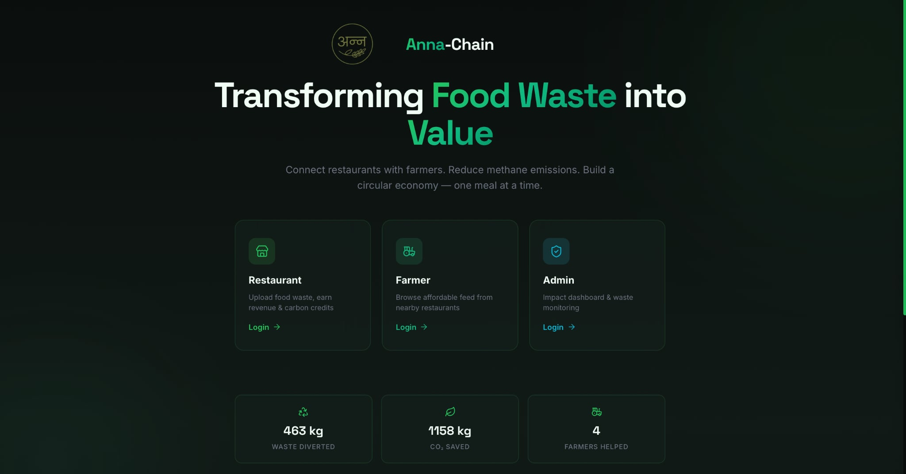
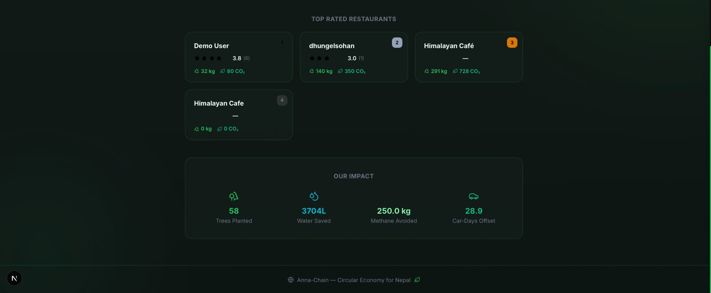
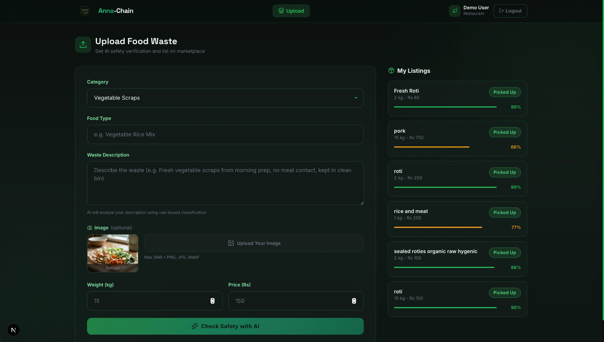
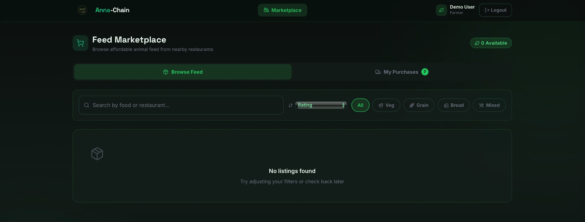
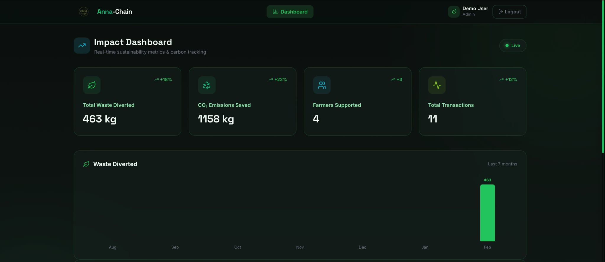
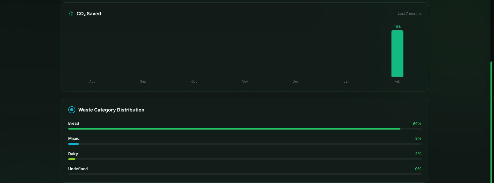
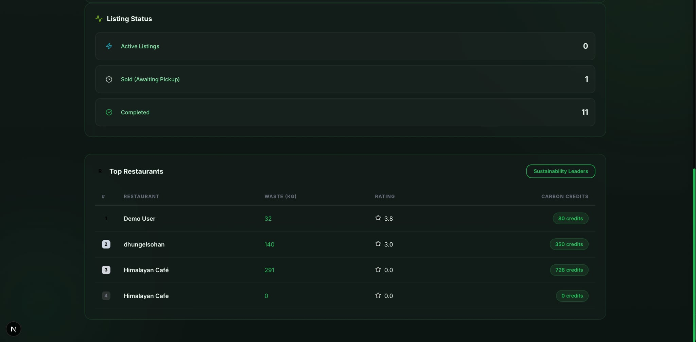

# Anna-Chain: Smart Food Waste Redistribution

---

##  Team Information

**Team Name:** Team Berserkers  

**Team Members:**  

Sabal Gautam - sabal.078bct054@acem.edu.np - thesarez  
Samiksha Gurung - samiksha.078bct056@acem.edu.np - samikshagurung  
Sohan Dhungel - sohan.078bct070@acem.edu.np - madaxe05  
Tisa Shrestha - tisa.078bct086@acem.edu.np - tisashrestha  

---

##  Project Details

**Project Title:** Anna-Chain: Smart Food Waste Redistribution  

**Category:** Open Innovation  

---

### Problem Statement

Food waste is a growing urban challenge in developing countries like Nepal. Restaurants, hotels, and food outlets generate large amounts of leftover food daily, most of which ends up in landfills. This creates multiple interconnected problems affecting the environment, economy, and governance.

---

### Solution Overview

Anna-Chain is a circular economy web platform that connects restaurants generating food waste with farmers who need affordable animal feed. The system includes AI-assisted rule-based safety verification to ensure only suitable waste is redistributed. It provides an environmental impact dashboard showing CO₂ reduction, waste diverted, and carbon credits earned. Restaurants gain green rewards and sustainability recognition, while farmers access low-cost local feed.

---

##  Technical Stack

**Frontend:** React  

**Backend:** Firebase Functions  

**Database:** Firebase Firestore  

**Authentication:** Firebase

**Other Technologies:** Python, Rule based classifier

---

##  Installation & Setup

Step-by-step instructions to run the project:

```bash
git clone https://github.com/madaxe05/berserkers.git
cd berserkers
npm install
npm run dev

---

## Screenshots

### Landing Page



*Landing page introducing Anna-Chain and allowing users to choose between restaurant, farmer, and admin roles.*

---

### Restaurant Waste Upload Page


*Interface for restaurants to upload food waste details for redistribution.*

---

### Farmer Marketplace


*Marketplace where farmers can browse available animal feed and coordinate pickups.*

---

### Admin Dashboard




*Admin dashboard for monitoring food waste listings, users, and environmental impact metrics.*
